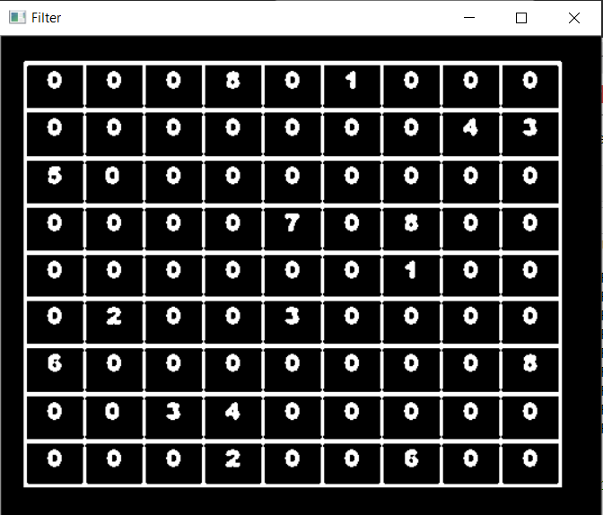
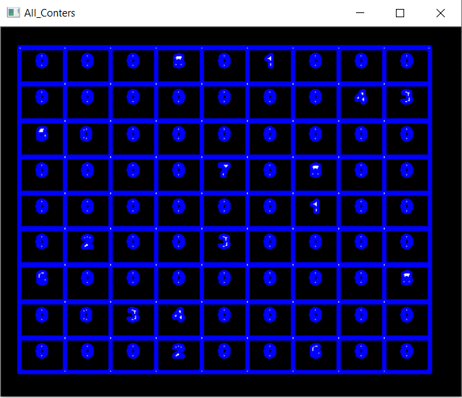
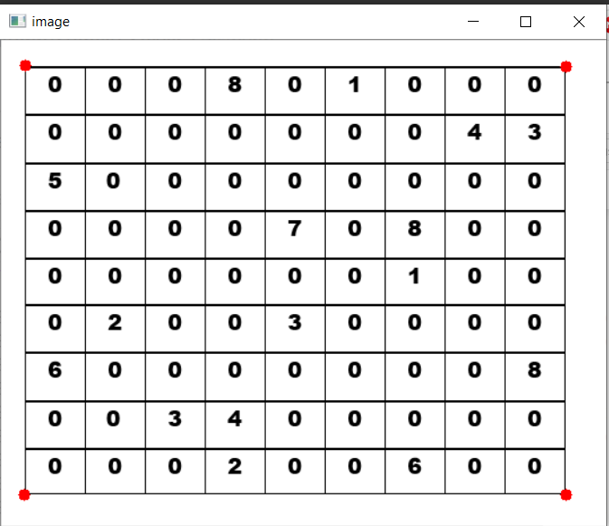
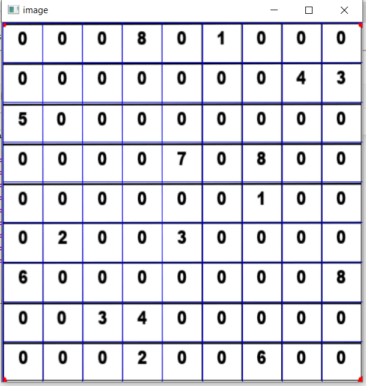
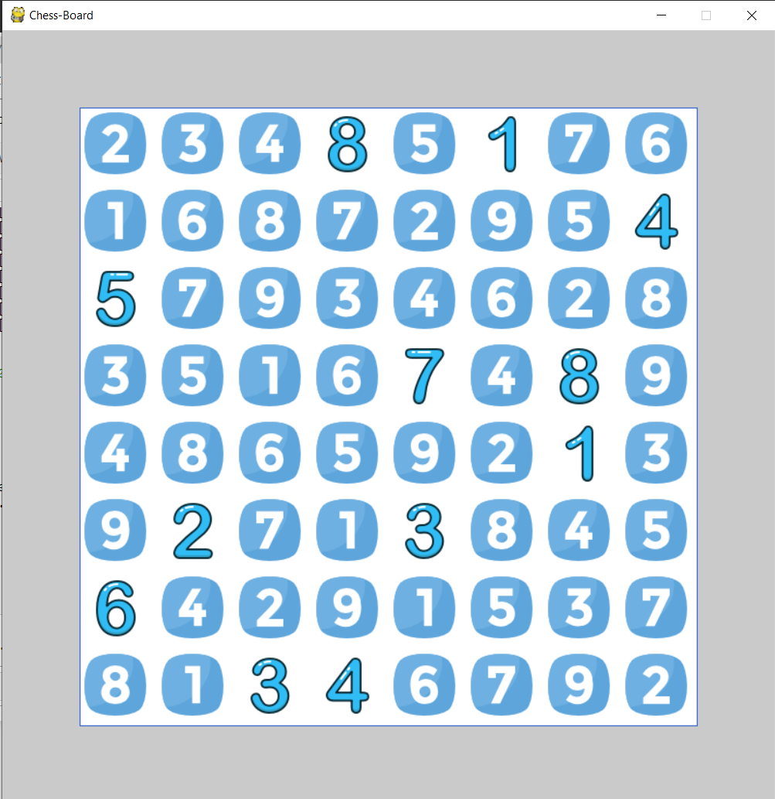

# Backtracking-Bump

<pre>
** Sudoku_Solver ** : A Real Time, Python Image based Sudoku Solver using  Opencv, Backtracking and Pygame Python Libraries . 
</pre>
# SUDOKU-SOLVER :                                    
### Solving --
<pre>

   ---->>>>    
   ---->>>>    
                                                         
</pre>

### Final Implementation Using Pygame --
<pre>
                                    
</pre>

